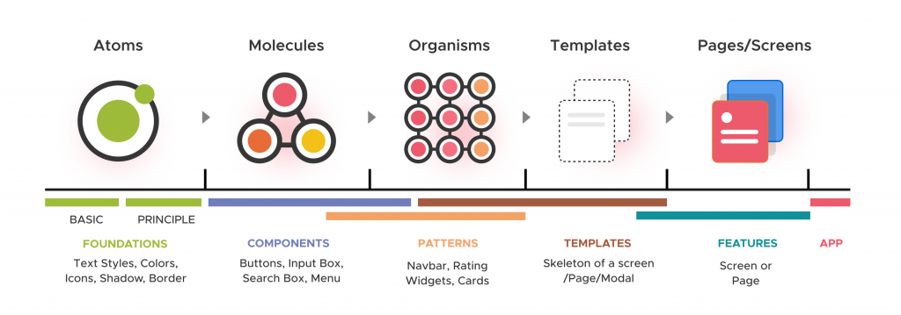
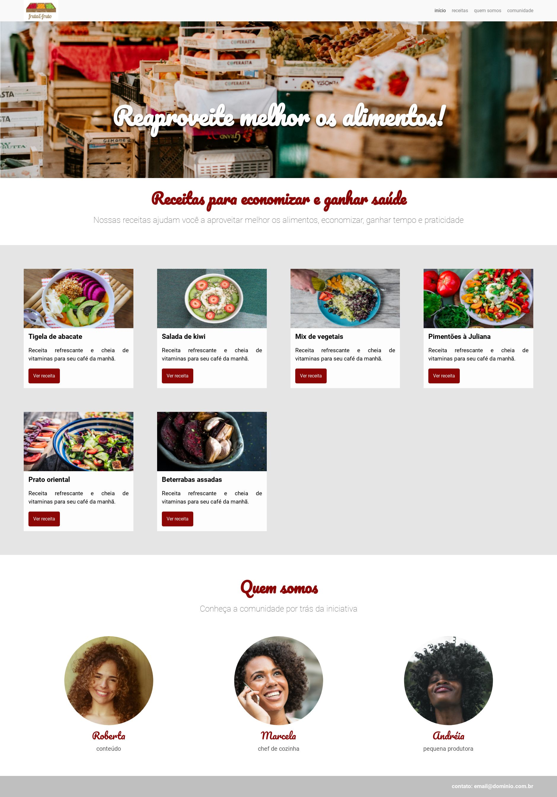

<h1 align="center">
    
</h1>

  :white_check_mark: <a href="https://andreadcsousa.github.io/alura_arquitetura_css/" target="_blank">Veja a página</a>
    &nbsp;&nbsp;&nbsp; | &nbsp;&nbsp;&nbsp;
  :white_check_mark: <a href="https://www.alura.com.br/curso-online-arquitetura-css" target="_blank">Conheça o curso</a>

# :computer: Projeto
 
- Idealizador: Alura
- Projeto: Formação Front-End
- Lado da força: Front-End
- Tipo: Arquitetura CSS
- Etapa: Atomic Design e BEM

# :rocket: Tecnologias

# :package: Recursos

### Atomic Design:

### Block Element Modifier (BEM)

# :art: Layout

